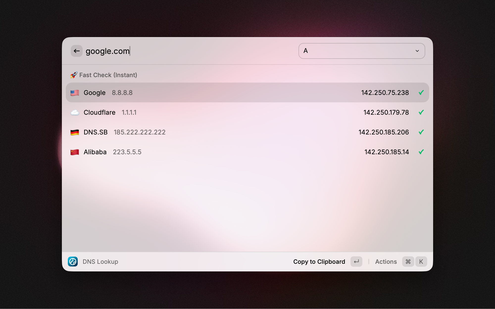
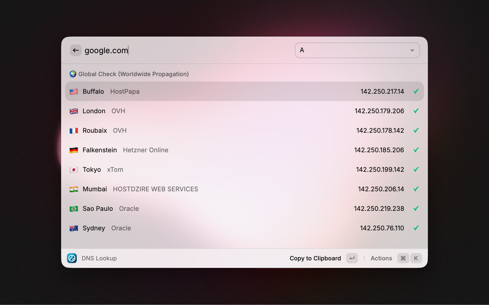

  
  <h1>DNS Lookup for Raycast</h1>
  
<em>Check DNS propagation instantly using the world's fastest resolvers and physical probes.</em>

---

DNS Lookup for Raycast is a powerful, zero-config tool designed for developers and sysadmins. It offers two modes: a **Fast Check** for immediate debugging via DoH (DNS over HTTPS) and a **Global Check** to verify worldwide propagation using physical probes via the Globalping network.

## 🚀 Features

### ⚡️ Fast Check (Instant)
Query the 4 major DNS providers simultaneously via DoH. Perfect for checking if your changes are live.
* 🇺🇸 **Google Public DNS** (8.8.8.8)
* ☁️ **Cloudflare** (1.1.1.1)
* 🇩🇪 **DNS.SB** (Europe)
* 🇨🇳 **Alibaba DNS** (Asia)

### 🌍 Global Check (Propagation)
Verify your DNS propagation across the globe using real physical probes (not just proxies).
* **Surgical Precision:** Queries 8 probes strategically distributed across **North America, Europe, Asia, South America, and Oceania**.
* **Real-world data:** Shows the ISP/Network name (e.g., Comcast, Orange, AWS) and the country flag.
* **Zero-Config:** Works out-of-the-box without an API key (uses the free tier limits).

### 🛠 Supported Records
* **Standard:** A, AAAA, CNAME, MX, NS, TXT.
* **Advanced:** SOA (formatted for readability) and SRV.

## ⚙️ Configuration (Optional)

The extension works perfectly without any configuration. However, power users can add a Globalping API Key to bypass the anonymous rate limits and use buyed Globalping credits if needed.

1.  Create an account on [Globalping](https://globalping.io/).
2.  Generate an API Token.
3.  Enter it in the Raycast extension preferences (`Cmd` + `,`).

## 📸 Screenshots

*Fast Check view showing results from major providers.*

*Global Check view showing worldwide propagation.*

## 💡 How to use

1.  **Enter a domain** (e.g., `google.com`).
2.  **Select a Record Type** (A, MX, TXT...) via the dropdown or argument.
3.  **Fast Check** runs automatically.
4.  **Press `Cmd + Shift + Enter`** (or select the action) to switch to **Global Check**.
5.  **Press `Enter`** on a result to copy it, or `Cmd + Enter` to see detailed output.

## 🛡 Privacy

This extension communicates directly with:
* `dns.google`
* `cloudflare-dns.com`
* `doh.dns.sb`
* `dns.alidns.com`
* `api.globalping.io`

No data is sent to any other third-party server or analytics.

---
Have feedback or need help? Feel free to reach out at hi@vltn.sh.

_This extension uses awesome services of [Globalping](https://globalping.io) and standard DoH providers. I am not affiliated with, partnered with, or compensated by any of these companies — I simply use their free services to make sysadmins' lives easier._
